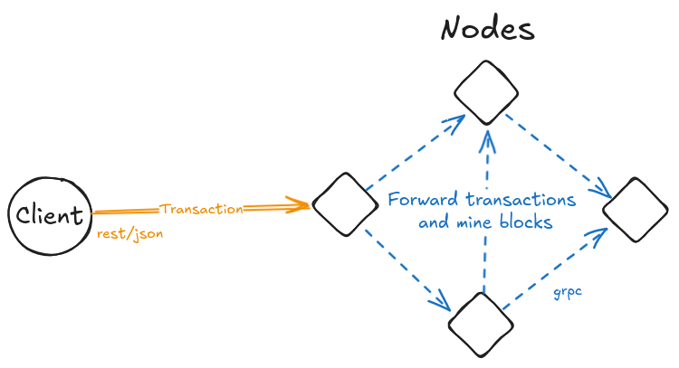

## Introduction

Lightweight and easy to understand chain implementation written in Go. This project features a Proof of Work consensus mechanism, gRPC for inter-node communication and a custom gossip protocol for node discovery.

## Features

- **Proof of Work Consensus:** Nodes calculate a nonce for a given difficulty to mine blocks.
- **gRPC Communication:** Nodes communicate using gRPC for efficient, language-agnostic messaging.
- **Custom Gossip Protocol:** A handmade gossip protocol is used for peer discovery and network resilience.
- **Merkle Root Verification:** Transactions are verified using Merkle trees, ensuring data integrity.
- **SHA-256 Hashing:** Blocks are hashed using the secure SHA-256 algorithm.
- **Ed25519 Key Pairing:** Public/private key cryptography is implemented using Ed25519 for secure transaction signing.
- **Adjustable Difficulty:** The mining difficulty can be dynamically adjusted to control block creation times.

## Architecture and Design



- **Block:** The core data structure containing transactions, a nonce, previous block hash, and more.
- **chain:** The distributed ledger, storing the chain of blocks.
- **Node:** Each peer in the network, responsible for mining, validating, and propagating blocks.
- **Gossip Protocol:** Custom protocol for node discovery and message propagation.

## Getting Started

### Prerequisites
- Go 1.22+ installed on your machine.

### Installation

1. Clone the repository:
   ```sh
   git clone https://github.com/raphadam/goblock.git
   ```
2. Navigate to the project directory:
   ```sh
   cd goblock
   ```
3. Install dependencies:
   ```sh
   go mod tidy
   ```
4. Run the chain node:
   ```sh
   go run ./cmd
   ```
